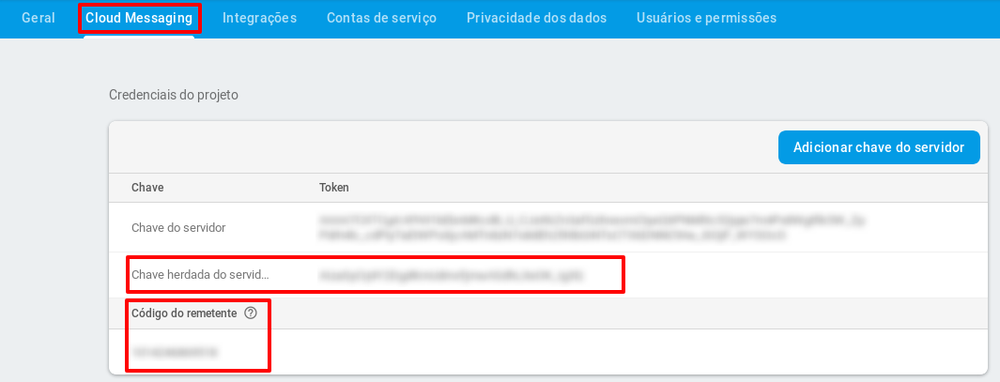

# Roteiro de instalação completo da solução multifator (IdP e MfaProvider).

## Pré-requisitos

 * IdP Shibboleth v3.3.

## Organização do roteiro

Este roteiro está dividido em 3 partes:

1. Roteiro de instalação da aplicação MfaProvider.
2. Roteiro de configuração para solução de multifator no Shibboleth IdP.
3. (Extras) Utilitários para Administrador.


# Roteiro de instalação da aplicação MfaProvider

## Baixar o projeto MfaProvider do git

O MfaProvider será a aplicação dentro do IdP responsável por gerenciar o segundo fator do usuário.

1.   Faça o download do projeto MfaProvider para o diretório de sua preferência. Pode ser utilizado o diretório home do usuário por exemplo.

     ```bash
     git clone https://git.rnp.br/GT-AMPTo/MfaProvider.git
     ```

## Configuração do Tomcat/Apache para funcionamento do MfaProvider.

*Obs: o roteiro foi desenvolvido considerando o servidor de aplicação tomcat na versão 8.*

### Arquivo de configuração da aplicação no Tomcat:

É necessário criar um arquivo xml com o pathname desejado (caminho a ser acessado pelo usuário para acessar o MfaProvider). Por padrão, o MfaProvider é configurado em `https://endereco-idp/conta`. Caso desejar utilizar outro pathname, alterar `conta` para o nome desejado nos próximos passos.

1.   Crie o arquivo xml através do comando: 

    ```bash
    sudo vi /etc/tomcat8/Catalina/localhost/conta.xml 
    ```

    Insira o seguinte conteúdo dentro do arquivo:

    ```xml
    <Context docBase="/opt/mfaprovider/mfaprovider.war"
        unpackWAR="true"
        swallowOutput="true">
        <Manager pathname="" />
    </Context>
    ```

    *Obs: o caminho /opt/mfaprovider/mfaprovider.war está definido no script de deploy da aplicação, não necessita alteração*

2. Edite o arquivo `server.xml` no diretório do tomcat:

   ```bash
   sudo vi /etc/tomcat8/server.xml
   ```

   Localize no arquivo, a tag: `<Service name="Catalina">` a adicione abaixo desta tag o seguinte conteúdo:

    ```xml
    <Connector port="9443" address="127.0.0.1" protocol="AJP/1.3" />
    ```

3. Edite o arquivo `01-idp.conf`:

   ```bash
   sudo vi /etc/apache2/sites-enabled/01-idp.conf
   ```

   Localize no arquivo, a tag: `<VirtualHost *:443>` e adicione dentro desta tag (abaixo do mesmo trecho de configuração de ProxyPass /idp) o seguinte conteúdo:
   *Obs: Caso utilizar outro  pathname, alterar `/conta` para o nome desejado.*

   ```xml
   ProxyPass /conta ajp://localhost:9443/conta retry=5
    <Proxy ajp://localhost:9443>
      Require all granted
    </Proxy>
   ```

4. Reinicie o serviço do Apache:

   ```bash
   sudo systemctl restart apache2 
   ```

## Instalação e configuração do banco de dados MongoDB

1. Baixe e instale o MongoDB pelo gerenciador de pacotes:

   ```bash
   sudo apt-get install mongodb
   ```

   *Obs: Ao termino da instalação, o serviço do MongoDB será instânciado automaticamente, o qual pode ser conferido pelo comando `ps -aux | grep mongo` (caso não estiver iniciado, utilize o comando `sudo systemctl start mongodb`).* 

2. No diretório que foi realizado o download do projeto MfaProvider, edite o arquivo `scriptMongo.js`:

   ```bash
   sudo vi scriptMongo.js
   ```

   + Defina os valores de `user` e `pwd` (usuário e senha) para segurança do banco e salve o arquivo:

     ```js
     use mfaprovider
     db.createUser(
        {
          user:"VALORDEFINIDO",
          pwd:"VALORDEFINIDO",
          roles: ["readWrite","dbAdmin"]
        }
     )
     ```

3. Ainda no diretório do projeto MfaProvider, execute o script para criar o usuário:

   ```bash 
   mongo < scriptMongo.js
   ```

4. No mesmo diretório, edite o arquivo `mongo.properties`:

   ```bash
   sudo vi src/main/resources/mongo.properties
   ```

   + Altere as propriedades `mongo.user` e `mongo.pass` com usuário e senha definidos anteriormente para o banco:

     ```xml
     mongo.host=localhost:27017
     mongo.db=mfaprovider
     mongo.user=VALORDEFINIDO
     mongo.pass=VALORDEFINIDO
     ```

5. Edite o arquivo de configuração do mongodb:

   ```bash
   sudo vi /etc/mongodb.conf
   ```

   + Habilite a autenticação descomentando o atributo `auth = true`. Ficará similar ao exemplo abaixo:

     ```bash
     # Turn on/off security.  Off is currently the default
     #noauth = true
     auth = true
     ```

- Reinicie o MongoDB

  ```bash
  sudo systemctl restart mongodb
  ```

## Configurações FCM para Diálogo de Confirmação 

Para funcionamento da opção multi-fator de diálogo de confirmação, é necessário possuir uma conta Google com o projeto FCM configurado. Siga os passos a seguir:

1. Acesse a página de console do FCM e faça login com a conta google: https://console.firebase.google.com/

2. Clique em `Adicionar Projeto`.

3. Digite um nome para o projeto (ingnore os demais campos), marque a opção "Aceito os termos.." e clique em `Criar projeto`.

4. Clique no ícone do Android para adicionar o Firebase ao app para Android, conforme imagem abaixo:

   

5. Informe no campo *Nome do pacote Android*: `br.gtampto.app2ampto` e clique em `Registrar APP`.

6. Nas etapas: *Fazer o download do arquivo de configuração* e *Adicionar o SDK do Firebase*, clique em `Próxima`.

7. Em *Execute seu app para verificar a instalação*, o FCM irá tentar conectar no aplicativo, como ele já foi configurado previamente, esta etapa pode ser ignora, clique em `Pular esta etapa`.

8. Após criar conta FCM e registrar o app seguindo as instruções, clique em configurações conforme imagem abaixo:

   

9.  Clique em `Configurações do Projeto` e na aba Cloud Messaging, anote os valores dos atributos `chave herdada do servidor` e `código do remetente` .  Segue imagem exemplificando o local dos atributos:

   

10. No diretório do projeto MfaProvider, edite o arquivo `mfaprovider.properties` 

    ```bash
    sudo vi src/main/resources/mfaprovider.properties
    ```

    + Utilizando os atributos anotados do FCM no item 9. Altere as propriedades conforme comentários no arquivo :

      ```xml
      ##substitua por chave herdada do servidor FCM
      br.rnp.xmpp.serverKey= XXXX
      
      ##substitua por código do remetente FCM
      br.rnp.xmpp.senderId= XXXXX
      
      #Substituir somente se utilizar um pathname diferente do padrão conta
      mfapbasepath=conta
      ```


## Configuração do MfaP como Service Provider:

1. No dirtório do projeto MfaProvider, edite o arquivo  `sp.properties`:

   ```bash
   sudo vi src/main/resources/sp.properties
   ```

   + Configure o arquivo conforme explicação nos comentários abaixo:

   ```xml
   ##Caminho completo do idp com o pathname
   host.name=https://endereco-idp/pathname
   
   ##Caminho completo para o metadata do idp
   idp.metadata=/opt/shibboleth-idp/metadata/idp-metadata.xml
   
   ##Defina um usuario e senha para proteção dos recursos rest
   restsecurity.user=xxx
   restsecurity.password=xxx
   
   ##Defina um usuario e senha para administrador do IdP
   admin.user=xxx
   admin.password=xxx
   ```

   *Obs: Os valores definidos neste momento para credenciais rest serão utilizados posteriormente na configuração de autenticação do IdP. Não utilizar o mesmo usuário e senha para admin e restsecurity*

### SP Metadata

1. No diretório do projeto MfaProvider execute o script para realizar o deploy da aplicação para configuraçaõ dos metadados.

```bash
./deploy.sh
```

2. Após, siga os procedimentos abaixo para gerar os metadados do MfaProvider:
   1. Acesse o endereço `https://endereco-idp/pathname/saml/web/metadata` via browser.

   2. Entre com o usuário e senha configurado para o administrador do IdP.

   3. Clique em `Gerar novo arquivo de metadados`

   4. Mantenha os dados já preenchidos por padrão e clique em `gerar metadados`

   5. Baixe o arquivo e salve com o nome `sp-metadata.xml`.

      + Copie o arquivo salvo `sp-metadata.xml` para o caminho dentro do diretório MfaProvider:

      ```bash
      src/main/resources/metadata/
      ```

### Configurar SP Metadata no IdP

- Os metadados do MfaProvider recém-gerados precisam ser carregados pelo IdP, copie o arquivo `sp-metadata.xml` para o diretório "metadata" no IdP (`/opt/shibboleth-idp/metadata`) e referencie, também no IdP, o path no arquivo `/opt/shibboleth-idp/conf/metadata-providers.xml`. 
Por exemplo:

```xml
<MetadataProvider id="LocalMetadata"  xsi:type="FilesystemMetadataProvider" 
      metadataFile="/opt/shibboleth-idp/metadata/sp-metadata.xml"/>
```

- Entre no diretório `/opt/shibboleth-idp/bin` e realize o build do IdP para utilizar as novas configurações:

```bash
./build.sh
```

## Deploy

- Retorne ao diretório do projeto MfaProvider e execute o script de deploy da aplicação novamente para utilização das novas configurações: 

```bash
./deploy.sh
```

Siga os próximos passos para relizar a configuração no IdP.

# Roteiro de configuração para solução de multifator no Shibboleth IdP

* Observações: 

  * Todos os arquivos indicados no tutorial, para copiar/utilizar como base na configuração do IdP, estão no diretório "alteracoes" do projeto baixado do git.

## Download do projeto:

- Faça o download dos fontes do projeto IdP-Customizado-GtAmpto, por exemplo, para o diretório home do usuário.

```bash
git clone https://git.rnp.br/GT-AMPTo/IdP-Customizado-GtAmpto.git
```

## Alteração do fluxo principal para Multifator:

- Edite o arquivo `/opt/shibboleth-idp/conf/idp.properties` e altere conforme explicação:

1. Localize a linha com a entrada  `idp.authn.flows` e altere o controle de fluxo para utilizar MFA:
    `idp.authn.flows= MFA`;
2. Localize a linha com a entrada `idp.additionalProperties` e acrescente ao final da linha: `/conf/authn/mfaprovider.properties`. Deve ficar similar ao listado abaixo:
    `idp.additionalProperties= /conf/ldap.properties, /conf/saml-nameid.properties, /conf/services.properties, /conf/authn/duo.properties, /conf/authn/mfaprovider.properties `

## Configurações gerais, flows, views, properties, libs e arquivos necessários:

- A partir do diretório do projeto baixado no git, copie o arquivo `alteracoes/conf/authn/mfaprovider.properties` para `/opt/shibboleth-idp/conf/authn/` e altere as propriedades apresentadas abaixo: 
  
```xml
## Enredeço do MfaProvider 
idp.mfaprovider.apiHost  = https://exemploidp.br/conta/
## Usuário e senha para autenticação REST configurado no sp.properties do projeto MfaProvider (<diretorio_git_MfaProvider>src/main/resources/sp.properties)
idp.mfaprovider.username  = usuario
idp.mfaprovider.password  = senha
```

1. Edite o arquivo `/opt/shibboleth-idp/conf/relying-party.xml` e configure conforme instruções comentadas no arquivo `alteracoes/conf/relying-party.xml` do projeto.

2. Configure as permissões para atributos do MfaProvider no `/opt/shibboleth-idp/conf/attribute-filter.xml` alterando as propriedades conforme instruções comentadas no arquivo `alteracoes/conf/attribute-filter.xml` do projeto.

3. Edite o arquivo `/opt/shibboleth-idp/conf/authn/general-authn.xml` alterando as propriedades conforme instruções comentadas no arquivo `alteracoes/conf/authn/general-authn.xml` do projeto.

4. Edite o arquivo `/opt/shibboleth-idp/messages/messages.properties` e configure conforme instruções comentadas no arquivo `alteracoes/messages/messages.properties` do projeto.

5. Copie o arquivo `alteracoes/conf/authn/mfa-authn-config.xml` para `/opt/shibboleth-idp/conf/authn/` sobrescrevendo o existente;

6. Copie o conteúdo do diretório `alteracoes/flows/authn` para  `/opt/shibboleth-idp/flows/authn`;

7. Copie o conteúdo do diretório `alteracoes/views` para  `/opt/shibboleth-idp/views`;

8. Copie o conteúdo do diretório `alteracoes/webapp/images` para  `/opt/shibboleth-idp/webapp/images`;

9. Copie o conteúdo do diretório `alteracoes/webapp/WEB-INF/lib` para `/opt/shibboleth-idp/webapp/WEB-INF/lib`.
    * Observação: As dependências contidas neste ditetório foram geradas a partir do projeto: [MfaProviderIdp](https://git.rnp.br/GT-AMPTo/mfadialogo). 
    
## Build IdP

- Execute o build do IdP em `/opt/shibboleth-idp/bin/build.sh` :

```bash
./build.sh
```

## Teste

- A aplicação será disponibilizada no endereço configurado, ex: `https://endereco-idp/conta`.
- Faça a autentiicação no IdP e verifique o auxílio da página para cadastrar e utilizar o segundo fator.


# (Extras) Utilitários para Administrador:

#### Remover segundo fator de determinado usuário:

- Na pasta do projeto do MfaProvider,  utilize o script abaixo e informe o login do usuário para remover as configurações de segundo fator

```bash
./removeSecondFactor.sh
```

#### Habilitar e desabilitar métodos de segundo fator:

- Na pasta do projeto do MfaProvider, edite o arquivo  `src/main/resource/factor.properties` e utilize `true` para habilitar ou `false` para desabilitar o fator desejado.