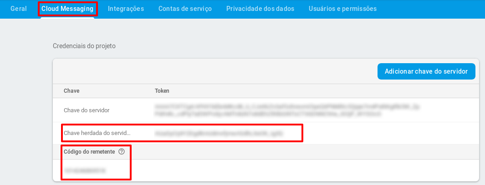

# Multi-factor installation guide (IdP and MfaProvider)


- [Multi-factor installation guide (IdP and MfaProvider)](#multi-factor-installation-guide-idp-and-mfaprovider)
  - [First Installation](#first-installation)
    - [Prerequisites](#prerequisites)
    - [FCM configuration for the Phone Prompt](#fcm-configuration-for-the-phone-prompt)
    - [Host settings](#host-settings)
    - [Self-signed Certificate](#self-signed-certificate)
    - [MongoDB Installation and Configuration](#mongodb-installation-and-configuration)
    - [MfaProvider Installation and configuration](#mfaprovider-installation-and-configuration)
    - [Basic Installation](#basic-installation)
    - [Advanced Installation](#advanced-installation)
    - [Tests](#tests)
  - [MfaProvider Update](#mfaprovider-update)
  - [Admin Utilities](#admin-utilities)
    - [User Second Factor Removal](#user-second-factor-removal)
    - [Enable or Disable Second Factor](#enable-or-disable-second-factor)

## First Installation

### Prerequisites
 * IdP Shibboleth v3.3, Tomcat 8 and Apache 2 already installed.

### FCM configuration for the Phone Prompt 

Follow the next steps in order to configure Google Firebase Cloud Messaging (FCM):

1.   [Create a Google Account](https://accounts.google.com/SignUp) for the institution (if you already have one, skip this step).
2.   Go to the [FCM console page](https://console.firebase.google.com/) and log in with the account from the step 1.
3.   Click on `Add Project`.
4.   Type a name for the project (ignore the other fields), check the "I Accept the terms.." option and then click on `Create Project`.
5.   Click on the Android icon to add Firebase to the Android app, as the following image shows:

6.  Fill in the *Android Package Name* field: `br.edu.ifsc.sj.gtampto` and click on `Register APP`.
7.   In the *Download the configuration file* step, click on `Next`.
8.   In the *Add Firebase SDK*, click on `Next`.
9.   In *Run your app to verify installation*, FCM will attempt to connect the app. As it is previously configured, this step can be skipped. So click on `Skip this step`
10.  When you finish creating the FCM account and registering the app according to the instructions, click on settings as the following image shows:


11.   Click on `Project Configurations` and then in the Cloud Messaging tab. Take note of the `Legacy server key` and `Sender ID` attribute values because they will be needed by the installation script.



### Host settings 

In order to the IdP be able to make requests to its own address, it is necessary to adjust the `/etc/hosts` configuration.

1.  Edit the `/etc/hosts` file:
```bash
sudo vi /etc/hosts
```
2.  Delete the line containing the `127.0.1.1` address. The edited file should look like the following:
```config
127.0.0.1       localhost
#IP Address and Host
191.36.8.39     idpexemplo.idp.edu.br idpexemplo
```
3.  Restart the network service in order to apply the new configuration: 
```bash
sudo systemctl restart networking.service
```

### Self-signed Certificate

The MfaProvider communicates with the IdP through HTTPs requests, so the Java Virtual Machine (JVM) needs to trust the certificate.
If the certificate is self-signed, it has to be imported to the JVM trust store with the following command:

```<JAVA_HOME>/bin/keytool -import -alias <server_name> -keystore <JAVA_HOME>/jre/lib/security/cacerts -file public.crt```

In case you don't know what certificate should be imported, run the following command to show the certificate file path:

```cat /etc/apache2/sites-enabled/01-idp.conf | grep SSLCertificateFile```

Assuming that your JAVA_HOME is /usr/lib/jvm/java-8-oracle and that the certificate to be imported is located at /etc/ssl/certs/server.crt, and that the server_name is idp.rnp.br, the command to import the certificate would be as follows:

```/usr/lib/jvm/java-8-oracle/bin/keytool -import -alias idp.rnp.br -keystore /usr/lib/jvm/java-8-oracle/jre/lib/security/cacerts -file /etc/ssl/certs/server.crt```

>**Attention:** You will be prompted to provide the JVM keystore password. The default password, if it wasn't changed already, is (usually) *changeit* .

Every time the certificate changes, this procedure has to be repeated.

After you finish the import, restart the Tomcat: `sudo systemctl restart tomcat8`

### MongoDB Installation and Configuration

Install MongoDB using the package manager:

```bash
sudo apt-get install mongodb
```
> **Obs:** When the installation is finished, the MongoDB service will start automatically. You can check if it is running, execute the following command: `sudo systemctl status mongodb.service` (if it is not running, you can start it by running `sudo systemctl start mongodb`).

    
### MfaProvider Installation and configuration

>**Obs:** run all the commands as user root

1.  Clone the `roteiro-instalacao` project to the directory of your choice. For instance, your home dir.
```bash
git clone https://git.rnp.br/GT-AMPTo/roteiro-instalacao.git
```
> **Obs:** If you run into certificate issues, you can run the following: `git -c http.sslVerify=false clone https://git.rnp.br/GT-AMPTo/roteiro-instalacao.git`

2.   Enter the directory where you have cloned the repository and cd into `scripts`. This will be our working dir in the next steps.
```bash
cd scripts
```

There are two ways of proceeding with the installation, a basic and an advanced one.
- In the basic one, the script will prompt you for the values of the basic variables for a standard multi-factor installation.
- In the advanced one, you can change the default path for the MfaProvider (`idp.instituicao.edu.br/conta`) or any other value related to dir paths and the like.

### Basic Installation

In the scripts dir, run the `install.py` script:
    
```bash
python2 install.py
```

The installation script will prompt you to define the following:

 - Username and password for the database;
 - Username and password for the REST endpoints;
 - IdP address without the protocol part. Ex.: `idp.instituicao.edu.br`;

When you finish the installation, check the section [Tests](#tests) to verify if the application is running.


### Advanced Installation

In the scripts dir, edit the `config.ini` file as the following:

a) In case you want to change `pathnames`:

- Metadata filepath:
    change the attribute: `idp.metadata=/opt/shibboleth-idp/metadata/idp-metadata.xml`

- IdP base dir:
    change the attribute: `dir_base_idp_shibboleth=/opt/shibboleth-idp`

- Tomcat's server.xml filepath:
    change the attribute: `tomcat_server_config=/etc/tomcat8/server.xml`

- Configuration file of the IdP in Apache:
    change the attribute: `apache_conf_file=/etc/apache2/sites-enabled/01-idp.conf`

b) In case you want to change the MfaProvider pathname:

-  Pathname:
    change the attribute `mfapbasepath=conta`

**Don't change the other attributes, the blank ones, because the installation script will prompt you to provide the information during the installation process.**

Finally, in the scripts dir, run the `install.py` script:
    
```bash
python2 install.py
```

When you finish the installation, check the section [Tests](#tests) to verify if the application is running.


### Tests

The MfAProvider will be available at the configured address, ex: `https://idp.instituicao.edu.br/conta`. Go to that address and log in to check the available help in the dashboard in order to configure and use a second factor.

> **Obs.:** If when you access that address, you are warned about certificate issues like *your connection is not private*, this may indicates that you have a self-signed certificate and will have to execute the procedure described in the section [Self-signed Certificate](#self-signed-certificate). **This will prevent errors after the login.**


## MfaProvider Update

When an update is available, you can update the MfaProvider using an available update script for that.

To do so, go to the directory where you have cloned the `roteiro de instalação` (according to the installation guide [MfaProvider Installation and configuration](#mfaProvider-installation-and-configuration)), and run the following:

```python update_mfaprovider.py ```

The above script will update the MfaProvider, by downloading the source code from the git repository, building the package to deploy on Tomcat 8 server and restarting it.


## Admin Utilities

### User Second Factor Removal

In the `/opt/mfaprovider` dir, run the following script, providing the user login that will have the second factor removed when prompted.

```bash
./removeSecondFactor.sh
```

### Enable or Disable Second Factor

After you run the installation script, you will have the MfaProvider source code available at `scripts/MfaProvider`. Edit the file `src/main/resource/factor.properties` and set to `true` to enable or to `false` to disable the factor you want to edit. After that, while you still are in the `scripts/MfaProvider` dir, run the following to deploy the MfaProvider for the changes to take effect:

```bash
./deploy.sh
```