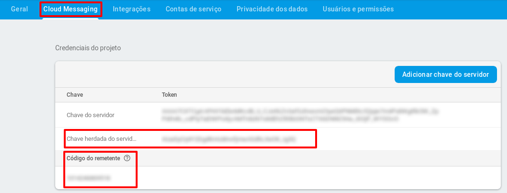

# Multifactor installation guide (IdP e MfaProvider)

## Prerequisites

 * IdP Shibboleth v3.3, Tomcat 8 and Apache 2 already installed.

## Manual Organization

The present manual is organized as follows:

### First Installation
1. [FCM configuration for the Phone Prompt](#fcm-configuration-for-the-phone-prompt)
2. [Host configuration](#host-configuration)
    - [Self-signed certificate](#self-signed-certificate)
3. [MongoDB Installation and Configuration](#mongodb-installation-and-configuration)
4. [MfaProvider Installation and configuration](#mfaprovider-installation-and-configuration)
    - [Basic Installation](#basic-installation)
    - [Advanced Installation](#advanced-installation)
    - [Tests](#tests)

### Update

1. [MfaProvider Update)](#mfapprovider-update)

### Admin Utilities

1. [Admin Utilities](#admin-utilities)
    - [User Second Factor Removal](#user-second-factor-removal)
    - [Enable or Disable Second Factor](#enable-or-disable-second-factor)

# FCM configuration for the Phone Prompt 


Para funcionamento da opção multi-fator com diálogo de confirmação, é necessário utilizar o servidor de fila de mensagens FCM do Google. 

Follow the next steps in order to configure FCM:

1.   [Create a Google Account](https://accounts.google.com/SignUp) for the institution (if you already have one, skip this step).

1.   Go to the [FCM console page](https://console.firebase.google.com/) and log in with the account from the step 1.

2.   Click on `Add Project`.

3.   Type a name for the project (ignore the other fields), check the "I Accept the terms.." option and then click on `Create Project`.

4.   Click on the Android icon to add Firebase to the Android app, as the following image shows:

     

5.  Fill in the *Android Package Name* field: `br.edu.ifsc.sj.gtampto` and click on `Register APP`.

6.   In the *Download the configuration file* step, click on `Next`.

6.   In the *Add Firebase SDK*, click on `Next`.

7.   In *Run your app to verify installation*, FCM will attempt to connect the app. As it is previously configured, this step can be skipped. So click on `Skip this step`

8.  When you finish creating the FCM account and registering the app according to the instructions, click on settings as the following image shows:

     

9.  Click on `Project Configurations` and then in the Cloud Messaging tab. Take note of the `Legacy server key` and `Sender ID` attribute values because they will be needed by the installation script.

     

# Host settings 

In order to the IdP be able to make requests to its own address, it is necessary to adjust the /etc/hosts configuration.

1.  Edit the /etc/hosts file:

```bash
sudo vi /etc/hosts
```
2.  Delete the line containing the `127.0.1.1` address. The edited file should look like the following:

```config
127.0.0.1       localhost
#Endereço de Ip e Host
191.36.8.39     idpexemplo.idp.edu.br idpexemplo
```

3.  Restart the network service in order to apply the new configuration:
    
```bash
sudo systemctl restart networking.service
```

## Self-signed Certificate

The MfaProvider communicates with the IdP through HTTPs requests, so the Java Virtual Machine (JVM) needs to trust the certificate.
If the certificate is self-signed, it has to be imported to the JVM trust store with the following command:

```<JAVA_HOME>/bin/keytool -import -alias <server_name> -keystore <JAVA_HOME>/jre/lib/security/cacerts -file public.crt```

In case you don't know what certificate should be imported, run the following command to show the certificate file path:

```cat /etc/apache2/sites-enabled/01-idp.conf | grep SSLCertificateFile```

Assuming that your JAVA_HOME is /usr/lib/jvm/java-8-oracle and that the certificate to be imported is located at /etc/ssl/certs/server.crt, and that the server_name is idp.rnp.br, the command to import the certificate would be as follows:

```/usr/lib/jvm/java-8-oracle/bin/keytool -import -alias idp.rnp.br -keystore /usr/lib/jvm/java-8-oracle/jre/lib/security/cacerts -file /etc/ssl/certs/server.crt```

>Attention: You will be prompted to provide the JVM keystore password. The default password, if it wasn't changed already, is (usually) *changeit* .

Everytime the certificate changes, this procedure has to be repeated.

After you finish the import, restart the Tomcat: `sudo systemctl restart tomcat8`


# MongoDB Installation and Configuration

1.  Install MongoDB using the package manager:

```bash
sudo apt-get install mongodb
```

> Obs: When the installation is finished, the MongoDB service will start automatically. You can check if it is running, execute the following command: `sudo systemctl status mongodb.service` (it it is not running, you can start it by running `sudo systemctl start mongodb`).
    
# MfaProvider Installation and configuration

>Obs: run all the commands as user root

1.  Clone the `roteiro-instalacao` project to the directory of your choice. For instance, your home dir.

```bash
git clone https://git.rnp.br/GT-AMPTo/roteiro-instalacao.git
```

> Obs: If you run into certificate issues, you can run the following: `git -c http.sslVerify=false clone https://git.rnp.br/GT-AMPTo/roteiro-instalacao.git`

1.   Dentro do diretório baixado do git,  acesse o diretório `scripts`. Este será nosso diretório base para execução dos próximos passos.

```bash
cd scripts
```

Há duas formas de realizar a instalação, de forma básica ou de forma avançada.
- Na instalação básica, o script irá questionar os valores das variáveis básicas para funcionamento padrão da solução de multifator.
- A instalação avançada é recomendada caso queira alterar o pathname padrão do MfaProvider (idp.instituicao.edu.br/conta) ou tenha algum problema na instalação básica devido a locais e diretórios diferente do padrão.


## Basic Installation

1.   In the scripts dir, run the `install.py` script:
    
```bash
python2 install.py
```
Serão realizados questionamentos durante a instalação, tais como:

 - Definição de usuario e senha do banco de dados;
 - Definição de usuario e senha para proteção dos recursos rest;
 - Endereço do IdP sem https, ex:  idp.instituicao.edu.br.

Após processo de instalação concluído, verificar a seção [Testes](#testes) para verificar o funcionamento da aplicação.

## Advanced Installation

1.   In the scripts dir, edit the config.ini file

```bash
vi config.ini
```

Edit the file as the following:

a) Caso deseje alterar o caminho dos diretórios:

- Endereço do metadata:
    alterar o atributo: `idp.metadata=/opt/shibboleth-idp/metadata/idp-metadata.xml`

- Diretório base do Idp:
    alterar o atributo: `dir_base_idp_shibboleth=/opt/shibboleth-idp`

- Endereço do server.xml do tomcat:
    alterar o atributo: `tomcat_server_config=/etc/tomcat8/server.xml`

- Endereço do arquivo de configuração do site do idp no apache:
    alterar o atributo: `apache_conf_file=/etc/apache2/sites-enabled/01-idp.conf`

b) Caso desejar alterar o pathname  (nome a ser acessado pelo usuário para acessar o MfaProvider no Idp) :

- Endereço do pathname:
    alterar o atributo `mfapbasepath=conta`

**Os demais atributos não devem ser alterados, os que estão sem informação o script de instalação irá solicitar durante o processo.**

Finally, in the scripts dir, run the `install.py` script:
    
```bash
python2 install.py
```

Após processo de instalação concluído, verificar a seção [Testes](#testes) para verificar o funcionamento da aplicação.

## Tests

- A aplicação será disponibilizada no endereço configurado, ex: `https://idp.instituicao.edu.br/conta`.

Ao acessar o endereço, caso apresentar a mesangem "Sua conexão não é segura" ou "Sua conexão não é particular" (dependendo do navegador), isto pode indicar que você possui um certificado autoassinado, e será necessário realizar o processo descrito
na seção: Utilitários para Administrador > Uso de certificado autoassinado ou expiração de certificado.
**Este processo evitará erro após processo de login.**

- Faça a autenticação e verifique o auxílio da página para cadastrar e utilizar o segundo fator.


# MfaProvider Update

Eventualmente pode ser necessário atualizar a aplicação multifator MfaProvider e esse procedimento pode ser feito separadamente.

Para isso, no diretório do roteiro de instalação (baixado conforme passo [Instalação da aplicação MfaProvider e configuração da solução de multifator no Shibboleth IdP](#instalação-da-aplicação-mfaProvider-e-configuração-da-solução-de-multifator-no-shibboleth-idP) da instalação inicial), execute o seguinte comando:

```python update_mfaprovider.py ```

The above script will update the MfaProvider, by downloading the source code from the git repository, building the package to deploy on Tomcat 8 server and restarting it.


# Admin Utilities

## User Second Factor Removal

- In the `/opt/mfaprovider` dir, run the following script, providing the user login that will have the second factor removed when prompted.

```bash
./removeSecondFactor.sh
```

## Enable or Disable Second Factor

- Na pasta do projeto `scripts/MfaProvider`, edite o arquivo  `src/main/resource/factor.properties` e utilize `true` para habilitar ou `false` para desabilitar o fator desejado. Após, ainda no diretório `scripts/MfaProvider`, execute o deploy da aplicação, através do comando:

```bash
./deploy.sh
```


